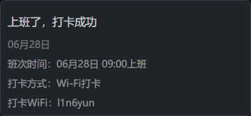

## PHP DingTalk Robot

钉钉机器人

## Install

```
composer require l1n6yun/dingtalk
```

## Usage

```php
use l1n6yun\DingTalk\Robot;
use l1n6yun\DingTalk\Message\Text;

$robot = Robot::create(
    '访问令牌',
    '加签'
);

$message = Text::make('我就是我, @XXX 是不一样的烟火');
$message->atMobiles(["180xxxxxx"]);
$message->atUserIds(["user123"]);
$message->atAll(false);

$robot->send($message->toArray());
```

text类型

```php
use l1n6yun\DingTalk\Message\Text;

$message = Text::make('我就是我, @XXX 是不一样的烟火');
$message->atMobiles(["180xxxxxx"]);
$message->atUserIds(["user123"]);
$message ->atAll(false);
```

link类型

```php
use l1n6yun\DingTalk\Message\Link;

$title = '时代的火车向前开';
$text = '这个即将发布的新版本，创始人xx称它为红树林。而在此之前，每当面临重大升级，产品经理们都会取一个应景的代号，这一次，为什么是红树林';
$messageUrl = 'https://www.dingtalk.com/s?__biz=MzA4NjMwMTA2Ng==&mid=2650316842&idx=1&sn=60da3ea2b29f1dcc43a7c8e4a7c97a16&scene=2&srcid=09189AnRJEdIiWVaKltFzNTw&from=timeline&isappinstalled=0&key=&ascene=2&uin=&devicetype=android-23&version=26031933&nettype=WIFI';
$picUrl = '';
$message = Link::make($title, $text, $messageUrl)->setPictureUrl($picUrl);
```

markdown类型

```php
use l1n6yun\DingTalk\Message\Markdown;

$text = <<<EOF
#### 杭州天气 @150XXXXXXXX 
> 9度，西北风1级，空气良89，相对温度73%
> 
> ###### 10点20分发布 [天气](https://www.dingtalk.com)
EOF;
$message = Markdown::make('杭州天气', $text);
$message->atMobiles(["180xxxxxx"]);
$message->atUserIds(["user123"]);
$message->atAll(false);
```

ActionCard类型

```php
use l1n6yun\DingTalk\Message\ActionCard;

// 整体跳转
$title = '乔布斯 20 年前想打造一间苹果咖啡厅，而它正是 Apple Store 的前身';
$text = <<<EOF
 
### 乔布斯 20 年前想打造的苹果咖啡厅
Apple Store 的设计正从原来满满的科技感走向生活化，而其生活化的走向其实可以追溯到 20 年前苹果一个建立咖啡馆的计划
EOF;
$message = ActionCard::make($title, $text, 0)
    ->setSingleTitle('阅读全文')
    ->setSingleURL('https://www.dingtalk.com');

// 独立跳转
$message = ActionCard::make($title, $text, 1);
$message->addBtn('内容不错', 'https://www.dingtalk.com/');
$message->addBtn('不感兴趣', 'https://www.dingtalk.com/');
// OR
$message = ActionCard::make($title, $text, 1);
$message->setBtns([
    [
        "title" => "内容不错",
        "actionURL" => "https://www.dingtalk.com/"
    ],
    [
        "title" => "不感兴趣",
        "actionURL" => "https://www.dingtalk.com/"
    ]
]);
```

FeedCard类型

```php
$title = "时代的火车向前开";
$messageURL = "https://www.dingtalk.com/";
$picURL = "https://img.alicdn.com/tfs/TB1NwmBEL9TBuNjy1zbXXXpepXa-2400-1218.png";
$message = FeedCard::make([[
    "title" => $title,
    "messageURL" => $messageURL,
    "picURL" => $picURL
]]);
$message->addLinks($title, $messageURL, $picURL)
$message->addLinks($title, $messageURL, $picURL);
```

自定义模板消息

```php
$message = Template::make("上班了，打卡成功");
$message->addMessage('班次时间','06月28日 09:00上班');
$message->addMessage('打卡方式','Wi-Fi打卡');
$message->addMessage('打卡WiFi', 'l1n6yun');
```



## Reference

https://developers.dingtalk.com/document/robots/custom-robot-access